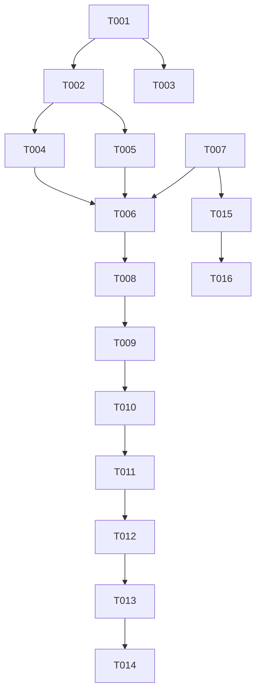

# Tasks: Ai là gián điệp

**Feature**: `001-ai-la-gian-diep` | **Total Tasks**: 18
**Spec**: [spec.md](./spec.md) | **Plan**: [plan.md](./plan.md)

## Phases

### Phase 1: Setup & Data
**Goal**: Initialize project structure and data layer.

- [x] T001 Create game module directory structure in `src/games/ai-la-gian-diep/`
- [x] T002 Copy provided type definitions to `src/games/ai-la-gian-diep/types.ts`
- [x] T003 Verify access to `src/data/ai-la-gian-diep.json` and create strict type import if needed

### Phase 2: Foundation (Logic & State)
**Goal**: Core game logic and state management.

- [x] T004 Implement random role assignment and keyword pair selection logic in `src/games/ai-la-gian-diep/utils.ts`
- [x] T005 [P] Implement `gameReducer` and `GameContext` in `src/games/ai-la-gian-diep/GameContext.tsx`
- [x] T006 Create main container `src/games/ai-la-gian-diep/AiLaGianDiep.tsx` wrapped in `GameProvider`
- [x] T007 Register new route `/ai-la-gian-diep` in `src/App.tsx`

### Phase 3: Game Setup (US1)
**Goal**: Allow host to select number of players.
**Test**: Launch game -> Enter 5 -> Confirm -> State updates to REVEAL phase.

- [x] T008 [US1] Implement `SetupScreen` component in `src/games/ai-la-gian-diep/SetupScreen.tsx` with validation (min 3 players)
- [x] T009 [US1] Integrate `SetupScreen` into `AiLaGianDiep` container (render when phase is SETUP)

### Phase 4: Role & Keyword Reveal (US2)
**Goal**: Pass-and-play flow for role distribution.
**Test**: Verify all players see words, distinct steps for View/Hide, correct role distribution.

- [x] T010 [US2] Implement `RoleRevealScreen` UI for "View Word" state in `src/games/ai-la-gian-diep/RoleRevealScreen.tsx`
- [x] T011 [US2] Implement "Hide/Pass" state transitions in `RoleRevealScreen.tsx`
- [x] T012 [US2] Integrate `RoleRevealScreen` into `AiLaGianDiep` container (render when phase is REVEAL)

### Phase 5: Discussion Phase (US3)
**Goal**: Transition to discussion after last player.
**Test**: Complete last player turn -> "Bắt đầu thảo luận" screen appears.

- [x] T013 [US3] Implement Discussion view (simple message/instruction) in `src/games/ai-la-gian-diep/AiLaGianDiep.tsx`
- [x] T014 [US3] Add phase transition logic in handler when last player finishes in `utils.ts` or reducer

### Phase 6: No Scoring Mode (US4)
**Goal**: Hide global score display for this game.
**Test**: Navigate to game -> Header score is gone -> Navigate Home -> Header score returns.

- [x] T015 [US4] Modify `src/App.tsx` or `src/components/ScoreDisplay.tsx` to conditionally render based on route path
- [x] T016 [US4] Ensure `ScoreDisplay` is hidden specifically for `/ai-la-gian-diep` route

### Phase 7: Polish & UI
**Goal**: Ensure visual consistency and polish.

- [x] T017 [P] Apply Tailwind styling to all new components matching user's black/white aesthetic
- [x] T018 Add entry instructions or rules modal if needed (optional)

## Dependencies

## Implementation Strategy

1. **Foundations First**: Get the state management and routing working.
2. **Interactive Flow**: Build the screens in order (Setup -> Reveal -> Discussion).
3. **Refinement**: Apply the hiding logic for the scoreboard last to ensure the game is functional first.
