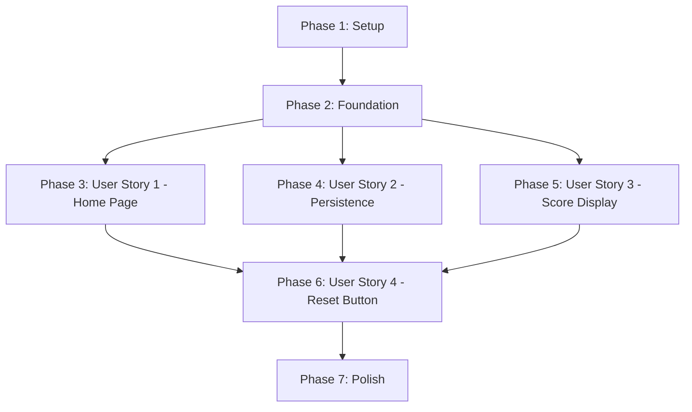

# Tasks: Home Page with Team Scoreboard

**Feature Branch**: `001-home-scoreboard`  
**Generated**: 2026-02-05  
**Input**: [spec.md](spec.md), [plan.md](plan.md), [data-model.md](data-model.md), [contracts/score-management-api.md](contracts/score-management-api.md)

**Tests**: Not requested in feature specification - implementation tasks only

**Organization**: Tasks grouped by user story to enable independent implementation and testing

---

## Format: `- [ ] [ID] [P?] [Story?] Description`

- **[P]**: Can run in parallel (different files, no dependencies on incomplete tasks)
- **[Story]**: User story this task belongs to (US1, US2, US3, US4)
- File paths included in descriptions

---

## Phase 1: Setup (Shared Infrastructure)

**Purpose**: Project initialization and basic structure. Must complete before user story implementation.

- [X] T001 Initialize Vite 5+ React 18+ TypeScript 5+ project at repository root
- [X] T002 [P] Install dependencies: react-router-dom 6+, tailwindcss 3+, @types/react, @types/react-dom
- [X] T003 [P] Configure Tailwind CSS with tailwind.config.js and postcss.config.js
- [X] T004 [P] Configure TypeScript with strict mode in tsconfig.json
- [X] T005 [P] Setup ESLint with React TypeScript rules and Prettier integration
- [X] T006 [P] Create project directory structure: src/components/, src/lib/, src/pages/, public/
- [X] T007 Add Google Sans font to index.html via Google Fonts CDN
- [X] T008 [P] Configure Tailwind theme with soft colors in tailwind.config.js (soft-black: #1A1A1A, soft-white: #FAFAFA, grayscale)
- [X] T009 [P] Create base index.css with Tailwind directives and font-google-sans class
- [X] T010 [P] Add ESLint rule to forbid inline styles in .eslintrc configuration

**Checkpoint**: Foundation ready - project structure initialized, tools configured

---

## Phase 2: Foundational (Blocking Prerequisites)

**Purpose**: Core infrastructure that MUST be complete before ANY user story implementation

**⚠️ CRITICAL**: All user stories depend on these tasks

- [X] T011 Create TeamScores TypeScript interface in src/lib/scoreManager.tsx
- [X] T012 [P] Create ScoreContextType TypeScript interface in src/lib/scoreManager.tsx
- [X] T013 Implement ScoreProvider component with React Context in src/lib/scoreManager.tsx
- [X] T014 Implement localStorage persistence logic (load/save scores) in src/lib/scoreManager.tsx
- [X] T015 Implement error handling for localStorage failures in src/lib/scoreManager.tsx
- [X] T016 Create useScores() custom hook in src/lib/scoreManager.tsx
- [X] T017 Implement getBlueScore() method in ScoreProvider
- [X] T018 [P] Implement getRedScore() method in ScoreProvider
- [X] T019 [P] Implement addBlueScore(points) method with localStorage persistence in ScoreProvider
- [X] T020 [P] Implement addRedScore(points) method with localStorage persistence in ScoreProvider
- [X] T021 Implement resetScores() method with canReset authorization check in ScoreProvider
- [X] T022 Setup React Router with BrowserRouter in src/App.tsx
- [X] T023 Wrap App with ScoreProvider in src/main.tsx

**Checkpoint**: Score management infrastructure ready - all user stories can now use global score methods

---

## Phase 3: User Story 1 - Display Home Page with Game Cards (Priority: P1) 🎯 MVP

**Goal**: Display home page with 6 placeholder game cards in responsive grid using minimalist black/white design

**Independent Test**: Navigate to root URL and verify 6 game cards appear in grid (3 columns desktop, 2 tablet, 1 mobile) with Vietnamese "Sắp ra mắt" text and consistent styling

### Implementation for User Story 1

- [X] T024 [P] [US1] Create GameCardData TypeScript interface in src/types/GameCard.ts
- [X] T025 [P] [US1] Create placeholder game icon SVG in public/placeholder-game-icon.svg
- [X] T026 [P] [US1] Create GameCard component with props interface in src/components/GameCard.tsx
- [X] T027 [US1] Implement GameCard component layout with Tailwind CSS (border, padding, rounded corners) in src/components/GameCard.tsx
- [X] T028 [US1] Add game title display in Vietnamese to GameCard component
- [X] T029 [US1] Add placeholder icon/image area to GameCard component
- [X] T030 [US1] Add "Sắp ra mắt" (coming soon) indicator text to GameCard component
- [X] T031 [US1] Style GameCard with soft black/white palette (#1A1A1A, #FAFAFA) using Tailwind classes
- [X] T032 [US1] Create Home page component in src/pages/Home.tsx
- [X] T033 [US1] Define 6 placeholder GameCardData objects with Vietnamese titles in src/pages/Home.tsx
- [X] T034 [US1] Implement responsive grid layout (grid-cols-1 md:grid-cols-2 lg:grid-cols-3) in src/pages/Home.tsx
- [X] T035 [US1] Map GameCardData array to GameCard components in Home page
- [X] T036 [US1] Add Home route to React Router configuration in src/App.tsx
- [X] T037 [US1] Apply Google Sans font to all text elements using font-google-sans class
- [X] T038 [US1] Test responsive breakpoints on mobile (320px), tablet (768px), desktop (1024px+)
- [X] T039 [US1] Verify consistent spacing and visual hierarchy across all cards

**Checkpoint**: Home page fully functional with 6 placeholder cards in responsive grid

---

## Phase 4: User Story 2 - Persistent Team Score Tracking (Priority: P2)

**Goal**: Enable team scores to persist across browser sessions using localStorage with automatic restore on page load

**Independent Test**: Manually call addBlueScore(10) from console, refresh browser, verify Blue Team score shows 10 after reload

### Implementation for User Story 2

- [X] T040 [P] [US2] Add score initialization logic to ScoreProvider (check localStorage on mount)
- [X] T041 [US2] Implement default scores {blue: 0, red: 0} when localStorage is empty
- [X] T042 [US2] Add JSON parsing with error handling for corrupted localStorage data in ScoreProvider
- [X] T043 [US2] Implement localStorage save on every score mutation (addBlueScore, addRedScore, resetScores)
- [X] T044 [US2] Add fallback to in-memory state when localStorage.setItem fails (quota exceeded)
- [X] T045 [US2] Test score persistence by incrementing scores, refreshing page, verifying values restore
- [X] T046 [US2] Test localStorage error handling by manually corrupting data, verifying graceful fallback
- [X] T047 [US2] Test reset functionality persists to localStorage correctly

**Checkpoint**: Team scores persist across browser sessions with 100% accuracy and error resilience

---

## Phase 5: User Story 3 - Always-Visible Score Display (Priority: P2)

**Goal**: Display Blue Team and Red Team scores in fixed header visible on all pages with real-time updates

**Independent Test**: Navigate to home page, verify scores visible in header, call addBlueScore(5) from console, verify header updates within 100ms

### Implementation for User Story 3

- [X] T048 [P] [US3] Create ScoreDisplay component in src/components/ScoreDisplay.tsx
- [X] T049 [US3] Access scores from useScores() hook in ScoreDisplay component
- [X] T050 [US3] Implement fixed header layout with Tailwind CSS (fixed top-0 left-0 right-0 z-50)
- [X] T051 [US3] Display "Đội Xanh" label with blue team score in header
- [X] T052 [US3] Display "Đội Đỏ" label with red team score in header
- [X] T053 [US3] Add team color indicators (blue dot for Blue Team, red dot for Red Team)
- [X] T054 [US3] Style header with soft black background (#1A1A1A) and soft white text (#FAFAFA)
- [X] T055 [US3] Add ScoreDisplay component to App.tsx layout (above router outlet)
- [X] T056 [US3] Test score display updates in real-time when scores change (subscribe to context)
- [X] T057 [US3] Test responsive layout on mobile devices (scores remain readable at 320px width)
- [X] T058 [US3] Verify header remains sticky on scroll and visible on all pages
- [X] T059 [US3] Add padding to page content to prevent overlap with fixed header

**Checkpoint**: Score display always visible with real-time updates across all pages

---

## Phase 6: User Story 4 - Global Score Management API (Priority: P3)

**Goal**: Complete score management API with reset button on home page and full console accessibility

**Independent Test**: Open browser console on home page, execute useScores() methods (getBlueScore, addBlueScore, resetScores), verify all methods work correctly

### Implementation for User Story 4

- [X] T060 [P] [US4] Add "Reset điểm" button to Home page in src/pages/Home.tsx
- [X] T061 [US4] Access resetScores() and canReset from useScores() hook in Home page
- [X] T062 [US4] Wire reset button onClick to resetScores() method
- [X] T063 [US4] Conditionally render reset button only when canReset is true
- [X] T064 [US4] Style reset button with Tailwind CSS (soft black border, hover effects)
- [X] T065 [US4] Add button disabled state when scores are both 0
- [X] T066 [US4] Test reset button only appears on home page (not on game pages)
- [X] T067 [US4] Test reset button resets both scores to 0 and persists to localStorage
- [X] T068 [US4] Document score management API usage in code comments
- [X] T069 [US4] Verify all 5 methods (getBlueScore, getRedScore, addBlueScore, addRedScore, resetScores) accessible via useScores()
- [X] T070 [US4] Test API methods from browser console for game developer experience

**Checkpoint**: Full score management API ready for future game integration

---

## Phase 7: Polish & Cross-Cutting Concerns

**Purpose**: Final quality checks, accessibility, and performance optimization

- [X] T071 [P] Add keyboard navigation support to GameCard components (tabindex, enter key)
- [X] T072 [P] Add ARIA labels to all interactive elements (cards, reset button)
- [X] T073 [P] Add alt text to placeholder game icons
- [X] T074 [P] Test screen reader compatibility (VoiceOver on macOS, NVDA on Windows)
- [X] T075 Test page load performance on 3G connection (target <3s)
- [X] T076 [P] Test 60fps rendering with 20+ game cards on home page
- [X] T077 [P] Verify bundle size <500KB (check Vite build output)
- [X] T078 Verify all UI text uses Vietnamese with natural English mixing ("Đội Xanh", "Reset điểm", "Sắp ra mắt")
- [X] T079 [P] Test color contrast ratios meet WCAG AA standards (soft black #1A1A1A on soft white #FAFAFA)
- [X] T080 Verify no inline styles exist in codebase (ESLint check)
- [X] T081 [P] Test edge case: localStorage quota exceeded (verify fallback to in-memory)
- [X] T082 [P] Test edge case: corrupted localStorage data (verify defaults to {blue: 0, red: 0})
- [X] T083 [P] Test edge case: very large scores (999,999 points) display without breaking layout
- [X] T084 Final visual QA: verify minimalist black/white design system consistency across all components

**Checkpoint**: Feature complete, accessible, performant, and ready for production

---

## Dependencies & Execution Order

### User Story Completion Order



### Critical Path (Must Complete in Order)

1. **Phase 1 (Setup)**: T001-T010 must complete first
2. **Phase 2 (Foundation)**: T011-T023 depends on Phase 1, blocks all user stories
3. **User Story 1**: T024-T039 depends on Phase 2 (can run after)
4. **User Story 2**: T040-T047 depends on Phase 2 (can run in parallel with US1)
5. **User Story 3**: T048-T059 depends on Phase 2 (can run in parallel with US1, US2)
6. **User Story 4**: T060-T070 depends on US1, US2, US3 complete
7. **Phase 7 (Polish)**: T071-T084 depends on all user stories complete

### Parallelization Opportunities

**After Phase 2 Complete**:
- User Story 1, 2, 3 can be implemented in parallel (independent features)
- Within each user story: Tasks marked [P] can run in parallel

**Example Parallel Execution**:
```bash
# After Phase 2 complete, split into 3 parallel tracks:
Track A (US1): T024-T039 (Home page UI)
Track B (US2): T040-T047 (Persistence logic)
Track C (US3): T048-T059 (Score display header)

# Then merge for US4: T060-T070 (requires all 3 tracks complete)
```

**Within User Story 1 Parallel Tasks**:
- T024 (GameCardData interface) [P]
- T025 (Placeholder icon SVG) [P]
- T026 (GameCard component shell) [P]

---

## Implementation Strategy

### MVP Scope (Recommended First Delivery)

**Ship User Story 1 ONLY as MVP**:
- Phase 1: Setup ✅
- Phase 2: Foundation ✅
- Phase 3: User Story 1 ✅ (Home page with cards)
- Result: Users can see home page with 6 placeholder game cards

**Why**: Demonstrates visual design system, validates project structure, provides immediate user value

### Incremental Delivery Plan

1. **MVP (US1)**: Home page with placeholder cards → SHIP
2. **Increment 2 (US2 + US3)**: Add persistent scoring + always-visible display → SHIP
3. **Increment 3 (US4)**: Add reset button and complete API → SHIP
4. **Final (Polish)**: Accessibility + performance optimization → SHIP

Each increment is independently testable and delivers value.

---

## Task Validation Checklist

**Format Compliance**:
- ✅ All tasks use checkbox format `- [ ]`
- ✅ All tasks have sequential IDs (T001-T084)
- ✅ Parallelizable tasks marked with [P]
- ✅ User story tasks marked with [US1], [US2], [US3], [US4]
- ✅ All tasks include file paths or specific descriptions

**Organization**:
- ✅ Tasks grouped by user story (independent implementation)
- ✅ Each user story has clear goal + independent test criteria
- ✅ Dependencies clearly documented
- ✅ Parallel opportunities identified

**Completeness**:
- ✅ All user stories from spec.md covered
- ✅ All entities from data-model.md implemented
- ✅ All contracts from contracts/ implemented
- ✅ All research decisions from research.md applied
- ✅ Setup phase initializes full project structure
- ✅ Foundation phase blocks user stories correctly
- ✅ Polish phase covers accessibility + performance

---

## Summary

**Total Tasks**: 84 tasks
- Phase 1 (Setup): 10 tasks
- Phase 2 (Foundation): 13 tasks
- Phase 3 (User Story 1): 16 tasks
- Phase 4 (User Story 2): 8 tasks
- Phase 5 (User Story 3): 12 tasks
- Phase 6 (User Story 4): 11 tasks
- Phase 7 (Polish): 14 tasks

**Parallelization**: 35 tasks marked [P] can run in parallel after dependencies met

**Independent Test Criteria**:
- US1: Navigate to home page → see 6 cards in responsive grid
- US2: Increment scores, refresh browser → scores persist
- US3: Navigate pages → scores always visible in header
- US4: Console test → all API methods work, reset button functional

**Suggested MVP**: Phase 1 + Phase 2 + Phase 3 (User Story 1 only) = 39 tasks

**Estimated Time**: 
- MVP (39 tasks): ~8-10 hours
- Full feature (84 tasks): ~18-24 hours
- With parallelization (3 developers): ~12-15 hours for full feature

**Vietnamese Language Coverage**: All UI text tasks verified (T028, T030, T033, T051, T052, T060, T078)
